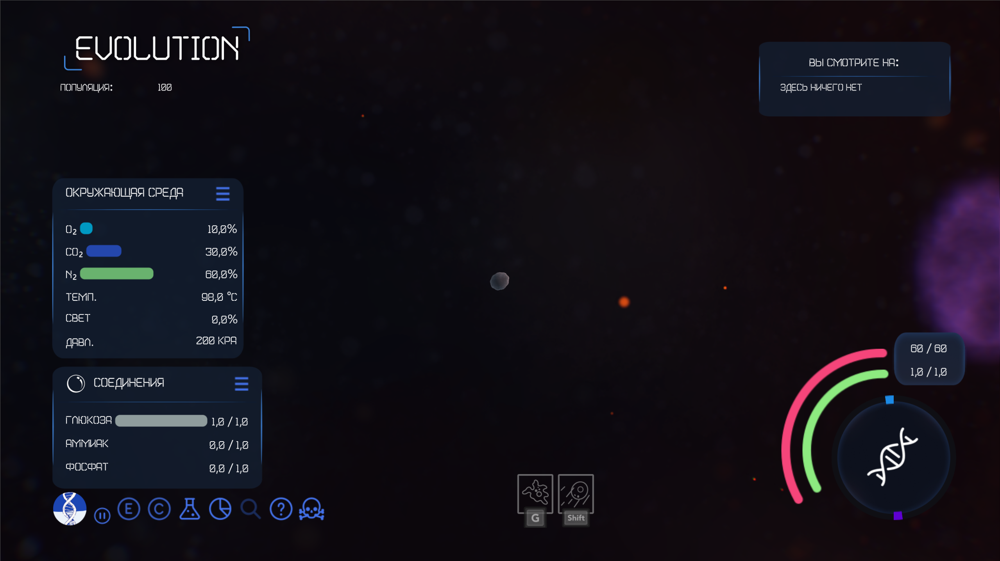

Berloga: Evolution
======

Главный научный сотрудник, Сергей Белых, проводит исследования в своем научном центре, стремясь понять механизмы эволюции и адаптации клеток. Он обнаруживает, что у него не хватает необходимых данных и экспериментов для глубокого анализа этих процессов. Профессор понимает, что для достижения своей цели ему срочно нужен сбор уникальных наблюдений и экспериментальных данных о том, как клетки развиваются и адаптируются в изменяющихся условиях.
В поисках решения он решает привлечь к работе научного сотрудника (игрока) и предлагает ему использовать новое технологическое чудо — симулятор под названием “Биосфера3000”, разработанную для полноценного моделирования жизни клетки в различных средах. С помощью этой машины игрок сможет проводить искаженные эксперименты, наблюдая за тем, как клетки взаимодействуют, выживают и эволюционируют.

 

Overview
--------

Repository structure:
- addons: Содержит в себе дополнения для IDE, которые устанавливаются непосредственно в проект, а не в редакор
- assets: This folder contains all the assets such as models and other binaries. 
- [doc: Documentation files.](/doc) Contains style guide, engine overview and other useful documentation.
- simulation_parameters: Contains JSON files as well as C# constants for tweaking the game.
- scripts: Utility scripts for Thrive development
- src: The core of the game written in C# as well as Godot scenes.
- test: Contains tests that will ensure that core parts work correctly. These don't currently exist for the Godot version.

### Programmers 
Папки assets и addons были перенесены с git lfs на облако, в связи с чем их загрузка производится через скрипт LoadFiles.PS1
